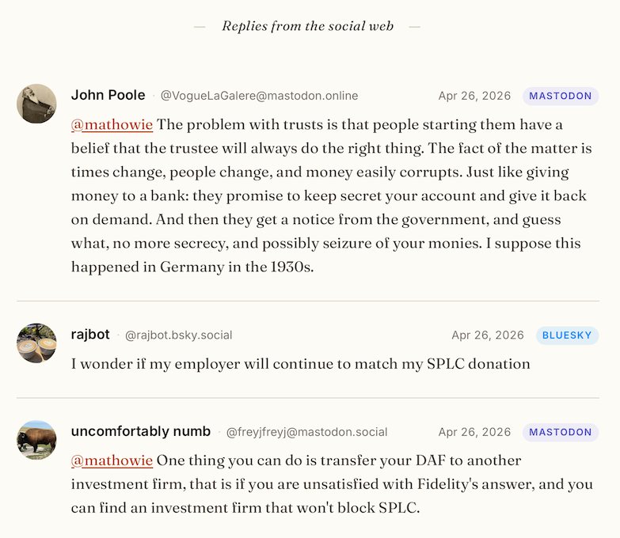

# Ghost Social Replies

This code was designed to let you display Mastodon and Bluesky replies as comments on your Ghost blog's posts.

It's a two-part add-on for any Ghost theme:

- **Theme integration** — drop-in CSS + JS that fetches social posts and renders them as comment-style cards below your post body
- **Helper tool** — A web UI for adding/removing reply URLs without having to hand-edit JSON, a local version as well as a hosted version

Both are vanilla, dependency-free, and MIT licensed.

## Why?

Many Ghost bloggers share their latest blog posts on Mastodon and Bluesky. But then the best discussions often happen in those social replies — where readers of a blog might never see them. This tool helps you as the author surface those threads on your posts, fetched live from the source platforms (no scraping, no copies).

## What it looks like

Here's a screenshot of what it looks like in action on https://a.wholelottanothing.org/



## How it works

1. **Per-post mentions URL list** lives in the post's Code Injection footer as a small JSON blob (`{"replies": ["url1", "url2"]}`)
2. **Theme template** has an empty `<section>` placeholder where replies render
3. **Client-side JS** reads the mentions URL list, fetches each post via Mastodon and Bluesky's public APIs (CORS-enabled, no auth needed), and renders styled cards
4. **Optional helper tool** provides a web UI for managing a mentions by URL list

For a deeper architecture explainer, see [`docs/architecture.md`](docs/architecture.md).

## Installation

### 1. Add to your theme

See [`theme/INTEGRATION.md`](theme/INTEGRATION.md) for step-by-step instructions specific to **Casper**. The same pattern works for any Ghost theme — the integration is just a CSS file, a JS file, and a small HTML snippet in `post.hbs`.

### 2. (Optional) Install the helper tool

See [`helper/README.md`](helper/README.md) for setup. You can either host a PHP version with your credentials saved in it on your own server (so it's availble anywhere on earth for you), or you can stick with a client-side HTML version to automatically write the JSON mentions list for you.

Two flavors are included:

- **`helper/replies-helper.html` + `helper/ghost-replies-proxy.php`** — the full helper, requires a PHP-capable server and your Ghost API information and automatically appends any social mentions to your post instantly.
- **`helper/replies-helper-standalone.html`** — a single self-contained file. No server needed. Offline mode builds the script block that you'll paste into Ghost manually. There's also an opt-in direct mode that talks to Ghost's Admin API straight from the browser (in-browser JWT, CORS permitting), skipping the copy/paste step.


## Adding replies to a post (no helper)

In Ghost admin:

1. Open any post
2. Click the gear icon → **Code injection** → **Post footer**
3. Paste:

```html
<script type="application/json" id="social-replies">
{
  "replies": [
    "https://mastodon.social/@someone/123456789",
    "https://bsky.app/profile/someone.bsky.social/post/abc123"
  ]
}
</script>
```

4. Replace example URLs with real ones, save the post

That's it. Replies render on next page load.

## Adding replies (with the helper)

To save your Ghost server settings in the Helper pages, go to your Ghost blog's settings, then the Integrations. Create a new custom integration, give it a name, then copy the Admin API key as well as the API URL to save in the helper app's code.

1. Open `replies-helper.html` in your browser
2. Search and pick a post
3. Paste URLs (one per line) in the textarea
4. Click **Save to Ghost**

The helper handles JSON formatting, deduplication, and removal of existing entries.

## Compatibility

- **Ghost** — works on Ghost(Pro) and self-hosted Ghost 5.x and 6.x
- **Themes** — Casper, Source, custom themes, Liebling, etc. The integration is theme-agnostic
- **Browsers** — modern evergreen browsers (Chrome, Safari, Firefox, Edge). Uses `fetch`, `Promise.all`, and CSS custom properties
- **Mastodon** — public posts from any instance, any version with the v1 API
- **Bluesky** — public posts only

## What this is NOT

- Not webmentions — there's no incoming federation. You curate which replies appear.
- Not real-time — replies render at page load, no websockets or live updates
- Not an automatic comment system — it's a one-way display of social-platform replies. Readers can't post directly to your blog (use Ghost's built-in comments for that, alongside this)
- Not analytics-aware — replies are fetched fresh each visit, no view tracking

## Contributing

Contributions, bug reports, and suggestions welcome. Open an issue or PR on GitHub.

Some ideas for future improvements:

- [ ] Server-side fetching at build time (for larger blogs / better performance)
- [ ] Support for Threads, Pixelfed, other Fediverse platforms with public APIs
- [ ] Quote-post / reply-context display ("in reply to...")
- [ ] Configurable sort order (newest-first, by likes, etc.)
- [ ] Show media attachments inline

## License

MIT. See [LICENSE](LICENSE).

## Credits

Built originally for [A Whole Lotta Nothing](https://a.wholelottanothing.org). Released for anyone who wants the same feature on their Ghost blog.
